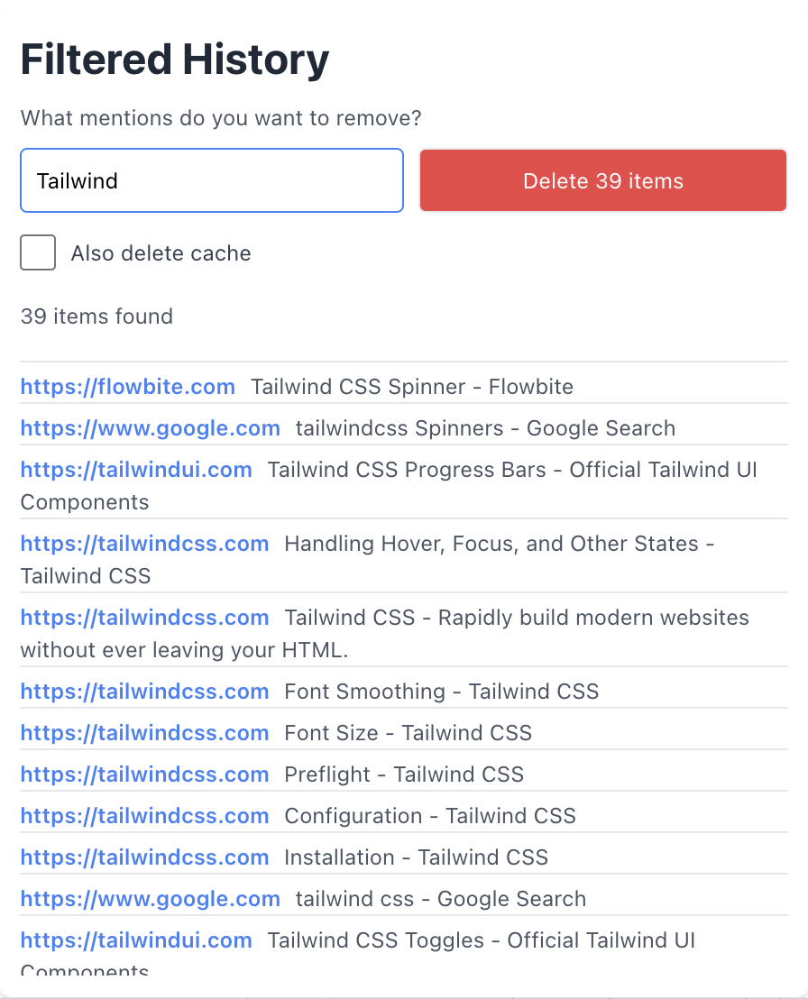

# Chrome Filtered History

Filtered History is a Chrome extension that allows you to manage and delete your browsing history based on custom filters set by the user. Ensure your privacy and keep your browsing history clean and relevant.

## Features

- **Custom Filters**: Enter keywords or phrases to filter and delete browsing history items.
- **Cache Deletion**: Optionally delete cache along with the browsing history.
- **User-friendly Interface**: Clean and simple UI designed with Tailwind CSS.
- **Instant Feedback**: Displays the number of items found and deleted based on the filter criteria.

## Usage

1.	Click on the Filtered History extension icon in the Chrome toolbar.
2.	Enter the keywords or phrases you want to filter in the browsing history.
3.	Check the “Also delete cache” checkbox if you want to delete cache along with the history items.
4.	Click the “Delete” button to remove the filtered items from your browsing history.

## Contributing

Contributions are welcome! Please feel free to submit a Pull Request or open an Issue to help improve this project.

## License

This project is licensed under the Apache License 2.0. See the [LICENSE](LICENSE) file for more details.
